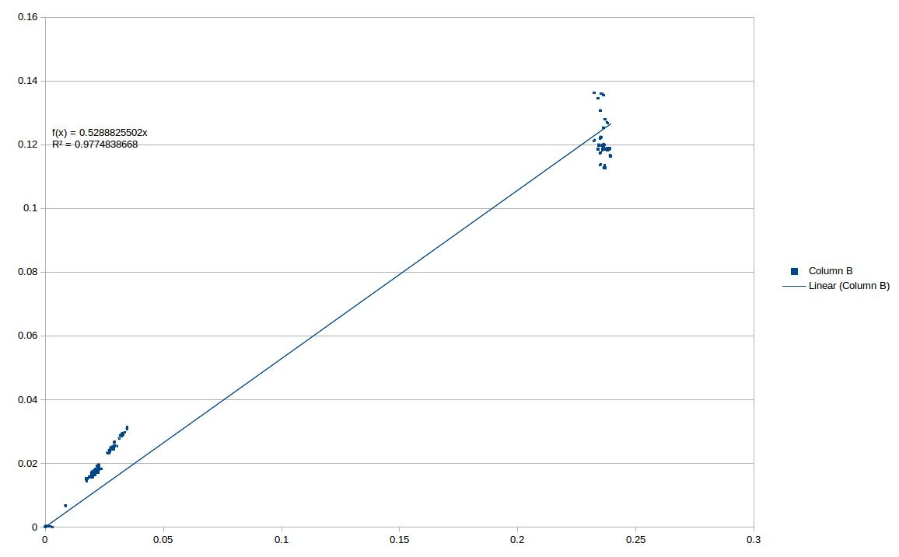

# Genome2GenomeDistance

Implementation of methods described in Meier-Kolthoff et al 2013. [Article Here](http://www.biomedcentral.com/1471-2105/14/60)

While the authors of that publication rightly believe that the BLAST algorithm gives more sensitivity for these questions , it comes at an extreme cost making application to large datasets computationally intractible. 

These programs provide a minimal implementation of their described methods so that the nucmer program could instead be employed using greedy trimming along with the equation __d<sub>4</sub>__ to calculate a distance between two genome assemblies.

##Synopsis of usage

```bash
cd test/

Create our manifests
../Split_Manifests --files Genomes/*.fa --chunk_size 200

#Run them from a single node 
for i in *.man; do ../G2GCalc --threads 32 --manifest $i ; done 


#If were on a cluster with SBATCH 
cp ../Array_Submit.slrm . 
sbatch --array=0-2 Array_Submit.slrm


#We should clean up a little once were done running
mkdir co-ords
mv *coords co-ords/
mkdir deltas
mv *delta deltas/

#Combine and plot 
#Get max elements 
ls Genomes/*.fa | wc -l 
#28
../CombineMatrices --max_elements 28 --files *.mtx --out test_join.mtx
```

##Outputs of the run
Alot of files. All of the coord and delta files are saved for now. After running the above sample they'll be in the co-ords and deltas folders respectively.

The main files of ineterest for most people will be the test_join.mtx file and the test_join.mtx.png. The test_join.mtx file is the symmetric distance matrix ordered by hc clustering.
The png is the actual graphic. 

A big run will look a little something like this:


For reference we compared our method against the G2GDC web server and while we're not getting the exact same number we're close enough that I'm comfortable saying we're right.




## G2GCalc

The core program. Currently runs mummer and retrieves MUMs , filters overlapping MUMs and keeping the longest alignment between any two overlapping MUMs, then calculates distance as the average calculated distance between 
reciprical MUMmer runs. Where a single distance metric is:

	2 * (Total Identical Nucleotides) / (Length of MUMs from Reference) + (Length of MUMs from Query) 


__Usage__:

```bash
  ./G2GCalc <options>
```

__Options__:

--manifest : instead of providing files on a a command line provide a file that contains a list of the files you wish to process. One file per line.

--threads : multi threading is supported. 

  
## Split_Manifests

Given a large number of files splits the work into many manifests so that analysis can be spread across many computers. 

__Usage__ : 

```bash
./Split__Manifests --files *.fa --chunk 40000
```
__Options__: 

--files : files you wish to be broken up in to sub manifests

--chunk : how big of a chunk you want each manifest to take up. (A chunk of 100 will consist of a sub matrix that is 10 x 10 files,unless it is on the diagonal then it will be 1/2 normal size)


##Array_Submit.slrm
SLURM job file for array jobs. You'll want to know the number of the last manifest in a split to use this.

__Usage__:
```bash
sbatch --array=1-last__manifest Array__Submit.slrm
```

__Options__:
	Anything you can edit in sbatch you can edit here. 


  


